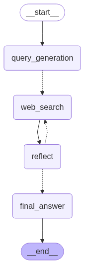

# LangGraph Web Search Agent

This project implements an intelligent web search agent using LangGraph, designed to perform iterative research by generating search queries, collecting results, and reflecting on the gathered information to determine if additional searches are needed.

## Features

- **Intelligent Query Generation**: Automatically generates relevant search queries based on the research topic
- **Iterative Research Process**: Performs multiple search cycles until sufficient information is gathered
- **Reflection Mechanism**: Evaluates collected information to determine if more research is needed
- **Structured Output**: Provides well-formatted answers with source citations

## How It Works

The agent follows a cyclic process:
1. **Query Generation**: Creates search queries based on the research topic
2. **Web Search**: Executes searches using Tavily search API
3. **Reflection**: Evaluates if the gathered information is sufficient
4. **Decision**: Either generates follow-up queries for additional research or provides a final answer

## Agent Workflow



The diagram above illustrates the complete workflow of the LangGraph web search agent, showing how queries are generated, executed, and refined through multiple research cycles.

## Prerequisites

- Python 3.8+
- Required environment variables:
  - `LLM_BASE_URL`: Base URL for the LLM API
  - `LLM_API_KEY`: API key for the LLM service
  - `TAVILY_API_KEY`: API key for Tavily search service

## Installation

1. Install required packages:
   ```bash
   pip install langchain langgraph langchain-openai langchain-tavily
   ```

2. Set up environment variables:
   ```bash
   export LLM_BASE_URL="your_llm_base_url"
   export LLM_API_KEY="your_llm_api_key"
   export TAVILY_API_KEY="your_tavily_api_key"
   ```

## Usage

Run the agent with a research topic:
```python
from graph import graph

initial_state = {
    "messages": "What is LangGraph?",
    "search_query_count": 1,
    "max_research_loops": 2
}

for event in graph.stream(initial_state):
    print(event)
```

## Project Structure

- `graph.py`: Main implementation of the LangGraph agent
- `prompt.py`: System prompts for query generation, reflection, and answer formatting
- `util.py`: Utility functions for handling research topics

## Configuration

Key parameters that can be adjusted:
- `search_query_count`: Number of initial search queries to generate
- `max_research_loops`: Maximum number of research cycles to perform

## Dependencies

- langchain
- langgraph
- langchain-openai
- langchain-tavily
- pydantic